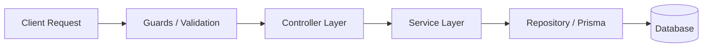

# 📋 Task Management System (Hệ thống Quản lý Công việc)

## 📖 Giới thiệu
Đây là dự án Backend xây dựng hệ thống **Task Management System** giúp người dùng quản lý dự án, phân công công việc (task), và tương tác thông qua bình luận (comment). 

Dự án được thiết kế theo tiêu chuẩn RESTful API hiện đại, áp dụng kiến trúc module hóa giúp dễ dàng bảo trì và mở rộng.

### 🛠 Tech Stack (Công nghệ sử dụng)
*   **Core Framework:** NestJS (Node.js/TypeScript)
*   **Database ORM:** Prisma / TypeORM
*   **Database Engine:** PostgreSQL
*   **Caching & Queue:** Redis
*   **Containerization:** Docker & Docker Compose
*   **Authentication:** JWT (JSON Web Token) & bcrypt

---

## 🏛 Kiến trúc Ứng dụng

Dự án tuân thủ chặt chẽ nguyên lý **Dependency Injection** và kiến trúc đa tầng (Layered Architecture) tiêu chuẩn của NestJS. Luồng xử lý một Request diễn ra theo mô hình sau:



### Mô tả luồng dữ liệu (Data Flow):
1.  **Guards & Validation:** Mọi request gửi lên đều đi qua `JwtAuthGuard` để xác thực người dùng (đã đăng nhập hay chưa). Sau đó, dữ liệu đầu vào (Body, Query) được "lọc" qua các DTO (Data Transfer Object) bằng `class-validator` để đảm bảo định dạng chuẩn trước khi đi sâu vào hệ thống.
2.  **Controller Layer:** Nơi tiếp nhận Request và trả về Response. Controller đóng vai trò như một "người điều phối", nó chỉ nhận dữ liệu đã được kiểm chứng, gọi Service tương ứng để xử lý và định dạng kết quả trả về cho Client. Tuyệt đối không chứa logic tính toán phức tạp ở đây.
3.  **Service Layer (Business Logic):** Đây là "trái tim" của ứng dụng, chứa toàn bộ quy tắc nghiệp vụ (Core Logic). Service sẽ xử lý các yêu cầu từ Controller, kiểm tra điều kiện (ví dụ: Task này có thuộc về Project kia không?), tính toán và đưa ra quyết định.
4.  **Repository / Prisma Layer (Data Access):** Tầng giao tiếp trực tiếp với cơ sở dữ liệu. Service sẽ gọi xuống tầng này để thực hiện các câu lệnh SQL (CRUD) thông qua ORM (Prisma/TypeORM). Việc tách biệt tầng này giúp ứng dụng không bị phụ thuộc cứng vào một loại Database cụ thể.

---

## ⚙️ Hướng dẫn cài đặt (Local Development)

### 1. Yêu cầu môi trường
* Node.js (>= 20.x)
* Docker & Docker Compose (để chạy Database & Redis)
* Trình quản lý package: `npm` hoặc `pnpm`

### 2. Cài đặt các thư viện
```bash
npm install
```

### 3. Cấu hình biến môi trường
Tạo file `.env` từ file mẫu:
```bash
cp .env.example .env
```
*(Sau đó cập nhật thông tin Database và JWT Secret trong file `.env`)*

### 4. Khởi chạy Database qua Docker (Tùy chọn)
```bash
docker-compose up -d
```

### 5. Chạy ứng dụng
```bash
# Chế độ phát triển (watch mode)
npm run start:dev

# Chế độ Production
npm run build
npm run start:prod
```

---

## 🧪 Hướng dẫn Test API
Hệ thống cung cấp file cấu hình API Document qua Swagger.
Sau khi khởi chạy ứng dụng thành công, truy cập trình duyệt tại địa chỉ:
👉 `http://localhost:3000/api` (hoặc đường dẫn được cấu hình) để xem chi tiết các Endpoint, Models và test trực tiếp API trên UI.

---

## ☁️ Deploy & CI/CD

Dự án này đã được cấu hình tích hợp liên tục (CI/CD) và sẵn sàng để chạy trên môi trường Cloud thực tế.

### 1. Tích hợp liên tục (CI) với GitHub Actions
Mỗi khi có code mới được đẩy (push) lên nhánh chính của Repo, GitHub Actions sẽ tự động chạy workflow để:
*   Kiểm tra format code (Linting).
*   Chạy toàn bộ các Unit Tests & E2E Tests (hiện dấu tick xanh ✅ nếu pass).
*   Build project để đảm bảo không có lỗi biên dịch.

### 2. Live Production URL (API Deploy Thực Tế)
Hệ thống backend đã được deploy thành công và đang chạy live tại đường dẫn sau:
*   **Production API URL:** `https://your-app-name.onrender.com` *(⚠️ Thay thế bằng URL thực tế sau khi deploy)*
*   **Swagger API Docs (Live):** `https://your-app-name.onrender.com/api/docs`

### 3. Môi trường triển khai
*   **Database Cloud:** PostgreSQL được cung cấp miễn phí thông qua [Neon.tech](https://neon.tech/) / [Supabase](https://supabase.com/) / [Aiven](https://aiven.io/).
*   **App Hosting:** Server Node.js/NestJS được host tự động thông qua [Render.com](https://render.com/) / [Railway](https://railway.app/) / [Fly.io](https://fly.io/). Quá trình deploy diễn ra hoàn toàn tự động mỗi khi repo GitHub có thay đổi nhờ tính năng Auto-Deploy.
